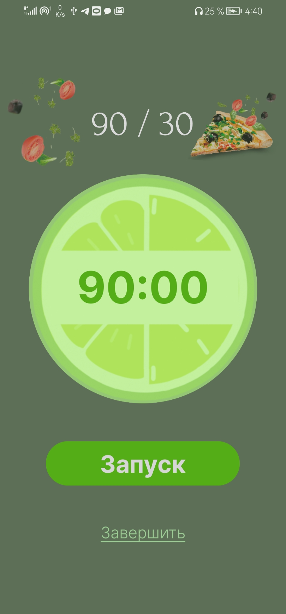

# TimeLime
Мобильное приложение на Android по тайм-менеджменту для организации времени между работой и отдыхом. Оно имеет несколько встроенных шаблонов для работы, а также позволяет создавать собственный шаблон. Наше приложение имеет особые преимущества: когда заканчивается время для работы, вы услышите характерный звук; также таймер подсвечивается, когда находится в режиме работы.

__Примечание:__ Чтобы иметь возможность войти в приложение, необходимо иметь созданную учетную запись с существующей электронной почтой. При закрытии приложения вы снова окажетесь на экране авторизации.

## Использование
Если вы хотите попробовать приложение, установите файл [.apk](TimeLime.apk), который вы можете запустить, зарегистрироваться/авторизоваться в нем и использовать уже существующие шаблоны или создать свой.

## Скриншоты
Здесь представлены скриншоты нашего приложения.

### Регистрация и Авторизация

### Главный экран

### Создание шаблона

### Работа таймера

# Приятного пользования!
